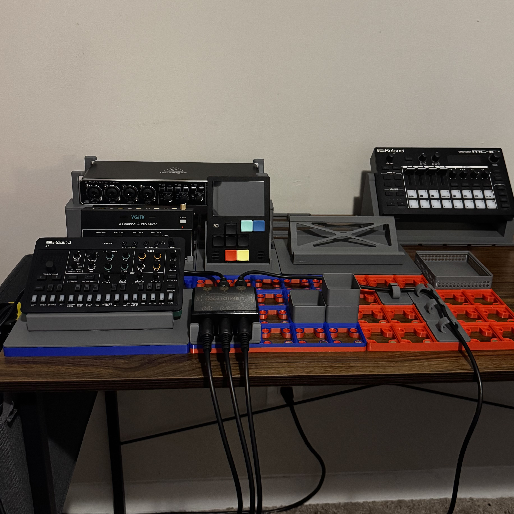

# Synth-Finity

 - Modular stands and organization system, designed around the Gridfinity base system.
   
    - Note: This system is designed primarily for mini and portable music gear (synths, grooveboxes, mixers, and utility devices). It is not recommended for full-size instruments or heavy equipment, as the stands and Gridfinity bases may not provide sufficient support.

## Overview

This repo contains 3D-printable, Gridfinity-compatible stands and risers for music gear.  
Files are organized into folders:

- [Stands](./Stands) – Synth, groovebox, and mixer stands:
    - Dirtywave M8 Tracker
    - Roland MC 101
    - Roland Aria Series
    - MIDIPro Midi Router
    - YGiTK 4 Channel Mixer
    - Behringer 404HD USB Audio Interface
      
- [Baseplates And Risers](./Baseplates%20And%20Risers) – Baseplates and risers
    - 5x5 Thin Base
    - 5x5 Magnetised
    - 4U (28mm) 1x1 Riser
    - 8U (56mm) 1x1 Riser
      
- [Utility](./Utility) – Cable guides and organizational accessories
    - Magnetised Base 1x1 cable guide
 
      

## Usage

1. Print the 3MF files using your preferred 3D printer.  
2. Combine with a Gridfinity base system; 5x5 thin and magnetized versions are included.  
3. Stack, organize, and customize your music gear setup.
4. 8x2mm Magnets are needed for magnetised bases and can be found in large quantity for a decent price.   

## License

All designs are licensed under **Creative Commons Attribution-NonCommercial 4.0 International (CC BY-NC 4.0)**.  
You may use, modify, and share these designs for **non-commercial purposes**, with attribution.  
Full license: https://creativecommons.org/licenses/by-nc-sa/4.0/

## Contributing

If you want to contribute new stands or improvements, please submit your `.STL` or `.3MF` files via a **GitHub Issue** in this repository.  

- Create a new issue and attach your files.  
- Clearly label the issue with your name or handle and a brief description of the design.  

All contributions MUST comply with the **`CC BY-NC-SA 4.0 license`**:  
- Non-commercial use only  
- Attribution must be given to the contributor and the original creator  

Submitted designs will be reviewed and added to the repository periodically.

## Resources 
- [Gridfinity Unofficial Wiki:](https://gridfinity.xyz/)
- [Gridfinity Generator: https:](//gridfinity.perplexinglabs.com/)

## Disclaimer

  - I am not a professional 3D designer; these designs are a hobbyist effort.  
  - I cannot provide troubleshooting for 3D prints.
  - Due to using a free Shapr3D license, I am unable to export `.STEP` files for further modification.
  - **Use at your own risk:** These stands are designed for mini and portable music gear.
    - Full-size or heavy equipment may cause the stands to fail. The creator(s) is not responsible for any damage or injury resulting from use.

